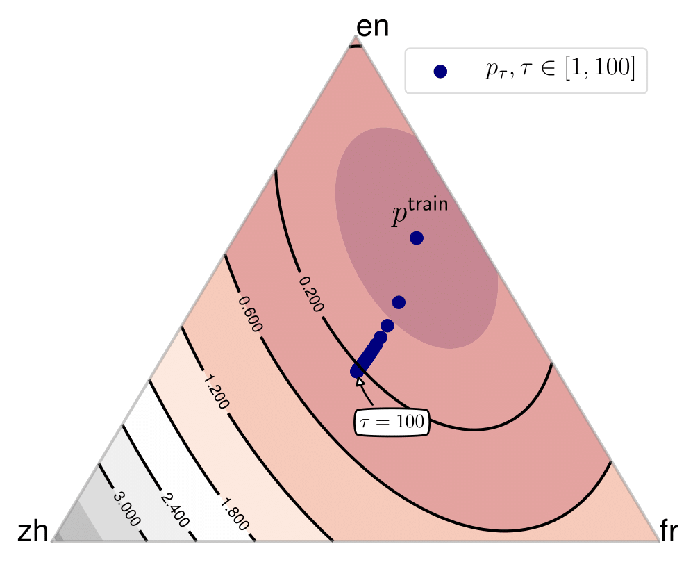

# Distributionally Robust Multilingual Machine Translation
This repository contains codes for experiments in the following [paper](tba).
```
Distributionally Robust Multilingual Machine Translation
Chunting Zhou*, Daniel Levy*, Xian Li, Marjan Ghazvininejad, Graham Neubig
EMNLP 2021
```
<br>


<br>

## Setup
- This repo is based on [fairseq](https://github.com/pytorch/fairseq) (tag [v0.10.0](https://github.com/pytorch/fairseq/releases/tag/v0.10.0))
  (please follow the instructions in the fairseq repo for requirements on apex, Python and Pytorch version.)
  ```
  cd fairseq; pip install --editable ./
  ```
  
## Training and Inference
Slurm scripts for training and decoding on the [TED58 dataset](https://drive.google.com/file/d/1xNlfgLK55SbNocQh7YpDcFUYymfVNEii/view?usp=sharing) can be found under `exps/`.
The preprocessing scripts of the datasets in the paper can be found under `utils/`.
Please replace the data path to your own MT data if you'd like to train on a different dataset.  

``sbatch exps/1_baseline_t1_chi_square_0.05_ted.sh``

To compute the baseline losses, `exps/eval_baselines_ted.sh` is an example script of how to load a pretrained ERM model for computing the average loss on the training set.

## Other baseline methods
The scripts for running other baseline methods can be found under exps/ as well, similarly, please replace with your own dataset hyperparameters correspondingly.
1. ERM
   
   ``sbatch exps/2_erm.sh`` or ``bash exps/2_erm.sh`` (need slight modification on the env variable SLURM_ARRAY_TASK_ID). 
   

2. CVaR group DRO with primal-dual method
   
   ``sbatch exps/3_baseline_cvar_pd.sh``
   

3. CVaR group DRO with our iterated best response (IBR)
   
   ``sbatch exps/4_baseline_cvar_ibr.sh``
   

4. Chi-square group DRO with primal-dual method
   
   ``sbatch exps/5_baseline_chi_square_primal_dual.sh``
   

5. group DRO (Sagawa et al., 2020)  
   ``sbatch exps/6_baseline_eg_reweight.sh``

## Reference
```
@inproceedings{zhou21emnlp,
    title = {Distributionally Robust Multilingual Machine Translation},
    author = {Chunting Zhou and Daniel Levy and Xian Li and Marjan Ghazvininejad and Graham Neubig},
    booktitle = {Conference on Empirical Methods in Natural Language Processing (EMNLP)},
    address = {Punta Cana, Dominican Republic},
    month = {November},
    year = {2021}
}
```


